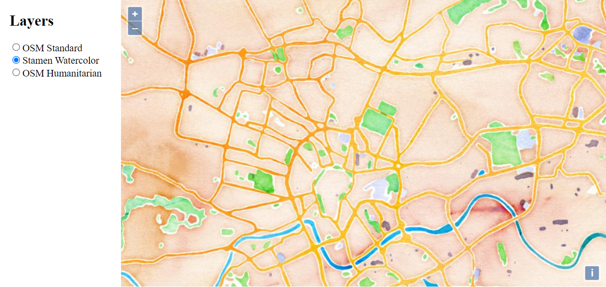
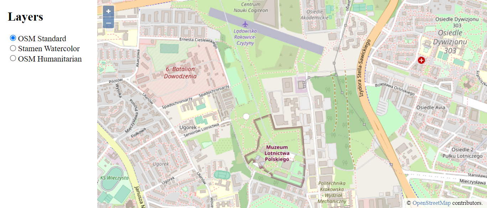
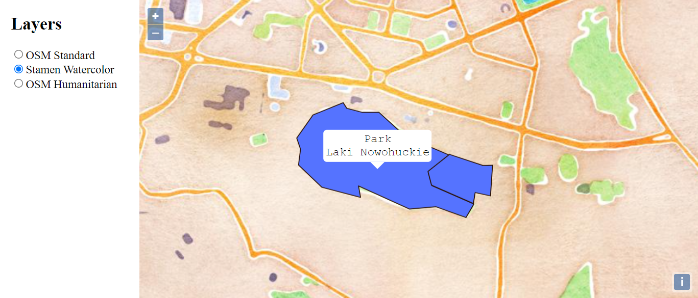
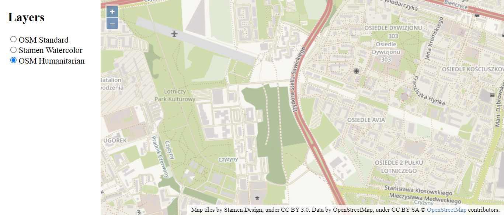

# Getting started with library OpenLayers

## General Info

Layers: vector map, Open Street Map,  Humanitarian, Watercolor map.

## Technologies
* HTML 
* CSS 
* JavaScript

## Screenshots

## Setup
How to run this project.
1. Clone this repo
2. To run, go to project folder and run Python 2: python -m SimpleHTTPServer 8000
Python 3: python -m http.server 8000
3. Open in browser http://localhost:8000/

## Status
Project is finished.

